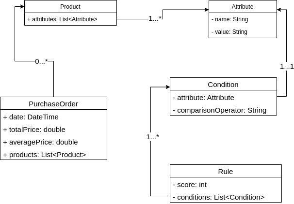

# Company Assignment

### Technical Requirements

* Minimum Docker version 20.10.17, build 100c701
* Minimum docker-compose version 1.25.0, build unknown
* Minimum curl 7.68.0 


### How to run it?
After installing Docker and Docker Compose you can run this line standing on the root of the payment folder

* `docker-compose build`
* `docker-compose up`

Once the container is up and running you can call the endpoint via the `curl` command:

```
curl -X POST localhost:8080/company/api/v1/purchase/score-products \
-H "Content-Type: application/json" \
-d '[
  {
    "attributes": [
      {
        "name": "name",
        "value": "Jeans"
      },
      {
        "name": "type",
        "value": "Clothing"
      },
      {
        "name": "color",
        "value": "BLUE"
      },
      {
        "name": "price",
        "value": 12
      },
      {
        "name": "quantity",
        "value": 20
      }
    ]
  },
  {
    "attributes": [
      {
        "name": "name",
        "value": "shirts"
      },
      {
        "name": "type",
        "value": "Clothing"
      },
      {
        "name": "color",
        "value": "RED"
      },
      {
        "name": "price",
        "value": 23
      },
      {
        "name": "quantity",
        "value": 20
      }
    ]
  }
]'
``` 


to display the total and average prices of those products that scored sufficiently
highly.

### Some assumptions & Remarks:

* To simulate that the rules are being pulled from a downstream service I implemented a concrete class  `RuleRepository` that is loading the rules written in the resources `classpath:data/rules.json`
* I didn't mock the repository mentioned above as there is no real downstream service that could potentially break the test if it's not available.
* Anyhow, Mocking the `RuleRepository` would have come handy to play with different rules scenarios. Just wanted to bring attention to this fact as the repository was not mocked.
* Even if the provided UML in the example went for a more structured approach defining specializations of the class  `Attribute` I went for an unstructured approach as it will give more flexibility when new attributes are added to a `Product` or a `Condition`
* Once all the containers are up and running you can check the auto generated swagger documentation [here](http://localhost:8080/swagger-ui/)


### UML Diagram



